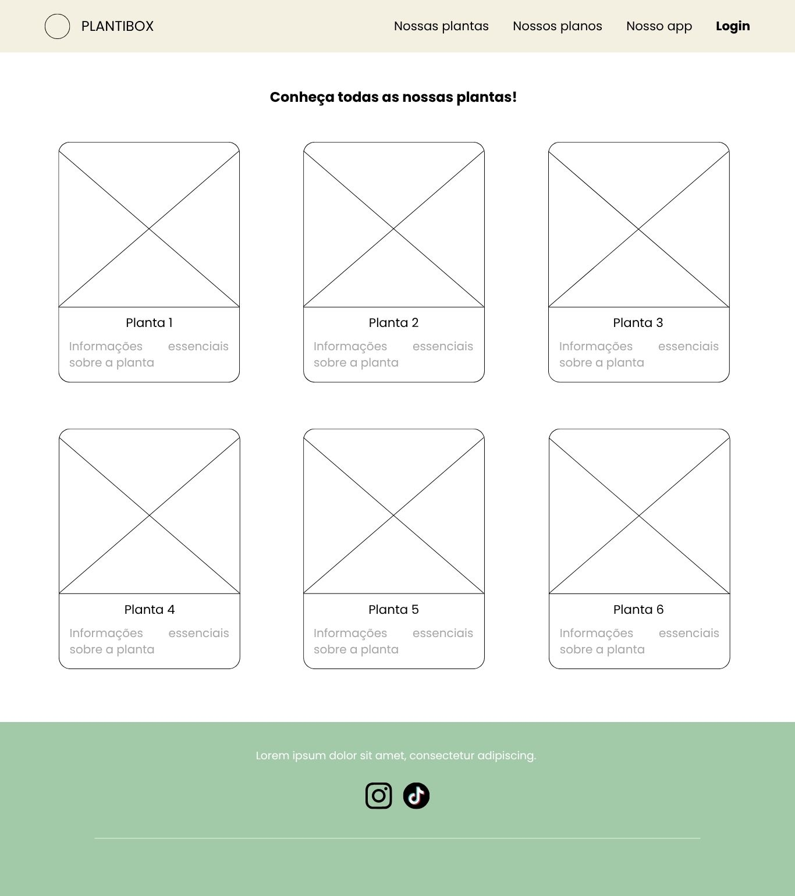
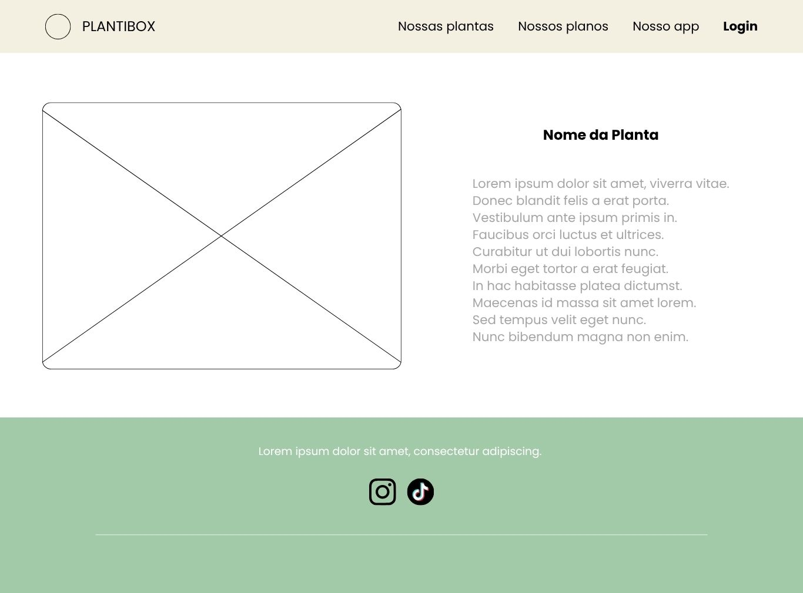

# PARTE 1

Página Inicial:


Landing page principal com apresentação do serviço.

Estrutura:

🔝 Header

- Logotipo + nome
- Menu de navegação:
  - Nossas plantas
  - Nossos planos
  - Nosso app
  - Login

⸻

🖼️ Hero Section

- Banner com imagem de fundo
- Texto descritivo central:
  - Explicação breve do serviço

⸻

⚙️ Seção “Como funciona?”

- 3 etapas ilustradas:
  1. Escolha do plano
  2. Recebimento da caixa
  3. Cuidados via app
- Cards com título + descrição

⸻

💰 Seção de Planos

- Destaque para três planos:
  - Starter
  - Nature Lover (marcado como mais popular)
  - Jungle Master
- Exibição de preço e benefícios
- Botão CTA: “Assine já”

⸻

🌱 Seção de Produtos (Mini-plantas)

- Grid com cards de plantas:
  - Imagem
  - Nome (Planta 1, 2, 3…)
  - Descrição breve

⸻

📱 Seção do Aplicativo

- Layout em duas colunas:
  - Imagem do app
  - Descrição funcional
- Destaques:
  - Guias de cuidado
  - Lembretes de rega

⸻

❓ FAQ (Dúvidas frequentes)

- Lista de perguntas expansíveis (accordion)

⸻

🔚 Footer

- Texto institucional
- Ícones sociais (Instagram, TikTok)

⸻

Características técnicas:

- Estrutura baseada em seções modulares
- Uso de cards reutilizáveis
- Layout com grid e flexbox
- Elementos de destaque (CTA, plano popular)
- Componentes interativos:
  - Accordion (FAQ)
- Design responsivo e escalável

Página de Login:


A tela de login apresenta uma interface minimalista e centralizada, com foco na autenticação do usuário.

Estrutura:

- Header fixo no topo contendo:
  - Logotipo (ícone + nome “PLANTIBOX”)
- Área principal centralizada verticalmente, composta por:
  - Título: “Acesse com seu login ou cadastre-se!”
  - Campo de entrada para e-mail
  - Campo de entrada para senha
- Ações disponíveis:
  - Botão primário: “Entrar”
  - Botão secundário: “Quero criar a minha conta”

Características técnicas:

- Background animado com pattern dinâmico de emojis de plantas (🪴, 🌿, 🌵) flutuando
- Formulário envolvido em um card (glassmorphism ou sólido com sombra premium)
- Layout com alinhamento central utilizando flexbox
- Inputs modernos com bordas arredondadas e padding confortável
- Botão primário com destaque na cor verde principal da paleta
- Design responsivo com foco em mobile-first

⸻

Página de Seleção de Planos (Checkout):

Tela destinada à escolha interativa de plano e inserção de dados para assinatura.

Estrutura:

- Header padrão com navegação.
- Seção: Escolha do plano
  - Grid interativo com os 3 planos (Starter, Nature Lover, Jungle Master).
  - Ícones em SVG exclusivos acompanhando cada plano.
  - Animação dinâmica: ao clicar, o card ganha destaque visual com borda verde, zoom suave e sombra premium.
- Seção: Dados Pessoais
  - Inputs (Nome completo, Email, CPF, Telefone, Endereço completo).
  - Layout em múltiplas colunas (CSS grid).
- Seção: Pagamento
  - Botões de toggle fluídos para alternar entre Pix e Cartão de Crédito.
  - Renderização condicional do formulário de cartão (Número, Nome, Validade, CVV).
- Ação final:
  - Botão de confirmação: “Confirmar Plano”
- Footer padrão.

Características técnicas:

- Utilização do hook `useState` do React para gerenciar o plano selecionado e a forma de pagamento ativa.
- Lógica de UI dinâmica para ocultar/exibir formulário de cartão baseado na escolha de pagamento.
- Inputs organizados em grid responsivo (`grid-template-columns`).
- Uso de transições CSS `transform` e `box-shadow` para feedback visual premium nos cards de planos.
- Prevenção de default action no envio do form (Frontend-ready para conexão de API).

Página Nossas Plantas:

Tela destinada a mostrar o catálogo completo de plantas oferecidas (expandido para 9 opções).

Estrutura:

- Header padrão com navegação fluída.
- Seção: "Conheça todas as nossas plantas!"
  - Grid com 9 cards de plantas.
  - Cada card possui: Imagem responsiva padronizada, Nome da Planta e Descrição detalhada.
- Footer padrão.

Características técnicas:

- Utilização do componente `PlantCard` modular e reutilizável.
- Layout estruturado em CSS Grid (3x3), forçando 3 colunas em Desktop via `repeat(3, 1fr)`.
- Responsividade perfeita adaptando para menos colunas em dispositivos móveis (`max-width: 900px`).
- Efeitos de `hover` nos cards (elevação e sombra) baseados nas variáveis globais do projeto.

Página com informações de uma única planta

Tela destinada à mostrar informações sobre a planta que foi selecionada.

Estrutura:

- Header padrão com navegação:
  - “Nossas plantas”, “Nossos planos”, “Nosso app”, “Login”
- Seção: Informações sobre a planta
  - Imagem da planta selecionada com todas as informações necessárias sobre ela, incluindo seu nome.
- Footer:
  - Texto institucional
  - Ícones de redes sociais (Instagram e TikTok)

Características técnicas:

- Utilização de rota dinâmica para mostrar informações sobre as plantas que foram selecionadas em cada card.

# PARTE 2

Nesta aula, realizamos a integração das diretrizes visuais do projeto através da implementação direta do arquivo global.css

```
"use client";
import Image from "next/image";
import styles from "./page.module.css";
import { useEffect } from "react";
import { useState } from "react";

export default function Home() {

  useEffect(() => {
    const elements = document.querySelectorAll(
      "section, article, figure, #app ul li, details"
    );

    elements.forEach(el => {
      el.classList.add("fade-in");
    });

    const observer = new IntersectionObserver((entries) => {
      entries.forEach(entry => {
        if (entry.isIntersecting) {
          entry.target.classList.add("visible");
          observer.unobserve(entry.target);
        }
      });
    }, { threshold: 0.1 });

    elements.forEach(el => observer.observe(el));
  }, [ ]);

  const [menuOpen, setMenuOpen] = useState(false);
```

Esse código usa useEffect para criar um efeito de animação ao rolar a página, executando apenas uma vez quando o site carrega, e começa selecionando vários elementos importantes do HTML como section, article, figure, itens de lista dentro de #app e elementos details, ou seja, praticamente todo o conteúdo visível da página; em seguida, ele adiciona a classe "fade-in" em todos esses elementos para deixá-los inicialmente invisíveis e levemente deslocados (geralmente com opacity: 0 e um pequeno translateY no CSS), depois cria um IntersectionObserver, que é uma API do navegador responsável por detectar quando um elemento entra na área visível da tela do usuário durante o scroll, e para cada elemento observado ele verifica se está visível usando entry.isIntersecting, e quando isso acontece adiciona a classe "visible" ao elemento, o que ativa a animação no CSS (normalmente mudando para opacity: 1, posição normal e aplicando uma transição suave), fazendo com que o elemento apareça de forma gradual e elegante; após isso, o código usa observer.unobserve para parar de observar aquele elemento específico, evitando processamento desnecessário e melhorando a performance, define também a opção { threshold: 0.1 }, que significa que a animação será ativada quando pelo menos 10% do elemento estiver visível na tela, e por fim inicia a observação em todos os elementos selecionados com observer.observe, resultando em um comportamento onde todo o conteúdo da página (como seções, cards de planos, imagens e FAQ) começa invisível e vai aparecendo suavemente conforme o usuário rola a página, criando uma experiência mais moderna, fluida e profissional.

```
return (
    <>
      <header>
        <a href="#" className="logo">
            
            
        </a>

        <button
          className="menu-toggle"
          onClick={() => setMenuOpen(!menuOpen)}
        >
          {menuOpen ? "✖" : "☰"}
        </button>

        <nav className={menuOpen ? "active" : ""}>
            <ul>
                <li><a href="#como-funciona">Como Funciona</a></li>
                <li><a href="#planos">Planos</a></li>
                <li><a href="#plantas">Nossas Plantas</a></li>
                <li><a href="#app">Nosso App</a></li>
                <li><a href="#planos">Assine Já</a></li>
            </ul>
        </nav>

      </header>

      <main>
          <section>
              <h1>Reconecte-se com a natureza, uma planta por vez.</h1>
              <p>Receba mini-plantas em casa todo mês e transforme seu espaço em um refúgio verde. Cuidar de plantas nunca foi tão fácil e prazeroso.</p>
              <a href="#planos">Quero minhas plantas!</a>
          </section>

          <section id="como-funciona">
              <h2>Como funciona?</h2>
              <div>
                  <h3>1. Escolha seu plano</h3>
                  <p>Selecione o plano de assinatura que mais combina com seu espaço e sua rotina.</p>
              </div>
              <div>
                  <h3>2. Receba sua caixa</h3>
                  <p>Enviamos mensalmente uma caixa surpresa com mini-plantas saudáveis e cheias de vida.</p>
              </div>
              <div>
                  <h3>3. Cuide com nosso app</h3>
                  <p>Use nosso guia digital para aprender a cuidar, receber lembretes de rega e se conectar.</p>
              </div>
          </section>

          <section id="planos">
              <h2>Encontre o plano perfeito para você</h2>

              <article>
                  <h3>Starter</h3>
                  <p>R$ 19,90/mês</p>
                  <ul>
                      <li>1 mini-planta por mês</li>
                      <li>Vaso decorativo simples</li>
                      <li>Acesso ao App Guia</li>
                  </ul>
                  <a href="#">Assinar Starter</a>
              </article>

              <article>
                  <h3>Nature Lover (Mais Popular)</h3>
                  <p>R$ 29,90/mês</p>
                  <ul>
                      <li>2 mini-plantas por mês</li>
                      <li>Vasos decorativos premium</li>
                      <li>Acesso total ao App Guia</li>
                      <li>Brinde surpresa</li>
                  </ul>
                  <a href="#">Assinar Nature Lover</a>
              </article>

              <article>
                  <h3>Jungle Master</h3>
                  <p>R$ 59,90/mês</p>
                  <ul>
                      <li>3 mini-plantas por mês</li>
                      <li>Vasos premium + suporte</li>
                      <li>Acesso total ao App Guia</li>
                      <li>2 brindes surpresa</li>
                  </ul>
                  <a href="#">Assinar Jungle Master</a>
              </article>
          </section>

          <section id="plantas">
              <h2>Algumas das nossas mini-plantas</h2>
              <figure>
                  
                  <figcaption>
                      <h4>Suculentas</h4>
                      <p>Perfeitas para iniciantes, amam sol e pouca água.</p>
                  </figcaption>
              </figure>
          </section>

          <section id="app">
              <h2>Mais que plantas, um guia na sua mão</h2>
              
              <p>Nosso app é o companheiro perfeito para sua jornada verde.</p>
              <ul>
                  <li>
                      <h4>Guias de Cuidado</h4>
                      <p>Tudo sobre sua nova planta: luz, água e curiosidades.</p>
                  </li>
                  <li>
                      <h4>Lembretes de Rega</h4>
                      <p>Avisamos a hora certa de regar, sem adivinhação.</p>
                  </li>
              </ul>
          </section>

          <section>
              <h2>Dúvidas Frequentes (FAQ)</h2>
              <details>
                  <summary>Posso escolher as plantas que vou receber?</summary>
                  <p>A PlantiBox opera em um modelo surpresa...</p>
              </details>
              <details>
                  <summary>Como as plantas sobrevivem ao transporte?</summary>
                  <p>Usamos embalagens ecológicas e seguras...</p>
              </details>
          </section>
      </main>

      <footer>
          <p>Reconectando pessoas e natureza, uma planta por vez.</p>
          <nav>
              <a href="#">Instagram</a>
              <a href="#">TikTok</a>
          </nav>
          <p>&copy; 2026 PlantiBox. Todos os direitos reservados.</p>
      </footer>

    </>
  );
}
```

O HTML presente nesse código funciona como o esqueleto e a estrutura semântica da sua página PlantiBox, definindo o significado e a hierarquia de cada conteúdo para que o navegador e os motores de busca entendam o que é cada parte. Através de tags como header, main e footer, ele organiza o layout em blocos lógicos, enquanto elementos de seção como section e article agrupam as informações de planos e serviços, e tags de conteúdo como h1, p, img e a dão propósito aos textos, imagens e links, garantindo que a interface tenha uma base sólida, acessível e organizada antes mesmo de receber qualquer estilo visual ou comportamento interativo.

# PARTE 3 — Componentização e Página “Nossas Plantas”

Nesta etapa do projeto, realizamos a componentização de partes importantes da interface utilizando React/Next.js. Criamos os componentes `Header`, `Footer` e `PlantCard`, deixando o código mais organizado, reutilizável e fácil de manter.

Além disso, desenvolvemos uma nova página chamada **Nossas Plantas**, responsável por apresentar todas as plantas disponíveis na assinatura da PlantiBox.

---

## Componentes Criados

### Header

O componente `Header` foi criado para representar o cabeçalho principal da aplicação.

#### Funcionalidades:

- Exibição da logo da marca;
- Menu de navegação;
- Botão responsivo para abrir e fechar o menu em telas menores;
- Utilização de `useState` para controlar o estado do menu mobile.

#### Código

```jsx
"use client";
import Image from "next/image";
import { useState } from "react";

const Header = () => {
  const [menuOpen, setMenuOpen] = useState(false);

  return (
    <header>
      <a href="#" className="logo">
        <Image
          src="/assets/logoplanticaixa.jpeg"
          alt="Logo ícone"
          width={50}
          height={50}
        />

        <Image
          src="/assets/logoplantiescrito.jpeg"
          alt="Logo Plantibox"
          width={120}
          height={40}
        />
      </a>

      <button className="menu-toggle" onClick={() => setMenuOpen(!menuOpen)}>
        {menuOpen ? "✖" : "☰"}
      </button>

      <nav className={menuOpen ? "active" : ""}>
        <ul>
          <li>
            <a href="#como-funciona">Como Funciona</a>
          </li>
          <li>
            <a href="#planos">Planos</a>
          </li>
          <li>
            <a href="#plantas">Nossas Plantas</a>
          </li>
          <li>
            <a href="#app">Nosso App</a>
          </li>
          <li>
            <a href="#planos">Assine Já</a>
          </li>
        </ul>
      </nav>
    </header>
  );
};

export default Header;
```

### Footer

O componente Footer foi criado para representar o rodapé da aplicação.

#### Funcionalidades:

Frase institucional da marca;
Links para redes sociais;
Direitos autorais.

#### Código

```jsx
const Footer = () => {
  return (
    <footer>
      <p>Reconectando pessoas e natureza, uma planta por vez.</p>

      <nav>
        <a href="#">Instagram</a>
        <a href="#">TikTok</a>
      </nav>

      <p>&copy; 2026 PlantiBox. Todos os direitos reservados.</p>
    </footer>
  );
};

export default Footer;
```

### PlantCard

O componente PlantCard foi criado para exibir as informações individuais de cada planta.

#### Props utilizadas:

imagem
nome
descricao

#### Funcionalidades:

Exibição da imagem da planta;
Nome da planta;
Pequena descrição sobre seus cuidados.

#### Código

```jsx
const PlantCard = ({ imagem, nome, descricao }) => {
  return (
    <div className="card">
      

      <div className="card-info">
        <h3>{nome}</h3>
        <p>{descricao}</p>
      </div>
    </div>
  );
};

export default PlantCard;
```

### Página “Nossas Plantas” (Atualizado)

Nessa etapa, expandimos a página Nossas Plantas, adicionando mais opções ao catálogo de assinaturas da PlantiBox.

#### Nessa página:

- Importamos os componentes `Header` e `Footer`;
- Criamos um array contendo os dados de 9 plantas diferentes;
- Utilizamos o método `.map()` para renderizar dinamicamente os componentes `PlantCard`;
- Adicionamos estilos inline combinados com o CSS global para formatar o título e a estrutura em grid.

#### Código da Página

```jsx
import Header from "../../componentes/Header";
import Footer from "../../componentes/Footer";
import PlantCard from "../../componentes/PlantCard";

export default function NossasPlantas() {
  const plantas = [
    {
      id: 1,
      nome: "Suculentas",
      descricao: "Perfeitas para iniciantes, amam sol e pouca água.",
      imagem: "/assets/suculentas.webp",
    },
    {
      id: 2,
      nome: "Cactos Mini",
      descricao: "Resistentes e cheios de personalidade. Baixa manutenção.",
      imagem: "/assets/minicactus.webp",
    },
    {
      id: 3,
      nome: "Mini Samambaias",
      descricao: "Folhagem exuberante que adora umidade e luz indireta.",
      imagem: "/assets/minisamambaia.jpg",
    },
    {
      id: 4,
      nome: "Jiboia",
      descricao:
        "Planta super adaptável, ótima para ambientes internos e purifica o ar.",
      imagem: "/assets/jiboia.webp",
    },
    {
      id: 5,
      nome: "Fitônia",
      descricao: "Pequena e com folhas desenhadas, adora sombra e umidade.",
      imagem: "/assets/fitonia.jpg",
    },
    {
      id: 6,
      nome: "Peperômia",
      descricao:
        "Folhas carnudas e fáceis de cuidar. Vai muito bem em luz indireta.",
      imagem: "/assets/peperomia.webp",
    },
    {
      id: 7,
      nome: "Clorofito",
      descricao:
        "A famosa 'planta-aranha', excelente para purificar o ar e pet-friendly.",
      imagem: "/assets/clorofito.webp",
    },
    {
      id: 8,
      nome: "Maranta",
      descricao:
        "Folhas vibrantes que se movem de acordo com a luz, a famosa 'planta rezadeira'.",
      imagem: "/assets/maranta.webp",
    },
    {
      id: 9,
      nome: "Lírio da Paz",
      descricao:
        "Elegante, fácil de cuidar e ainda ajuda a purificar o ar. Precisa de pouca luz.",
      imagem: "/assets/liriodapaz.webp",
    },
  ];

  return (
    <>
      <Header />

      <main>
        <h1
          style={{
            textAlign: "center",
            paddingTop: "4rem",
            color: "var(--verde-escuro)",
          }}
        >
          Conheça todas as nossas plantas!
        </h1>

        <section
          className="grid-plantas"
          style={{
            display: "grid",
            gridTemplateColumns: "repeat(3, 1fr)",
            gap: "2.5rem",
            maxWidth: "1000px",
            margin: "0 auto",
            padding: "2rem 5% 5rem",
          }}
        >
          {plantas.map((planta) => (
            <PlantCard
              key={planta.id}
              nome={planta.nome}
              descricao={planta.descricao}
              imagem={planta.imagem}
            />
          ))}
        </section>
      </main>

      <Footer />
    </>
  );
}
```

# PARTE 4

### Página de Seleção de Planos (Checkout)

A tela de Checkout foi construída para permitir que o usuário escolha o plano desejado e insira seus dados para finalizar a assinatura.

#### Funcionalidades:

- Utilização de `useState` para controlar o plano selecionado e a forma de pagamento (Pix ou Cartão de Crédito);
- Feedback visual instantâneo na seleção dos planos (borda, escala e sombra);
- Renderização condicional dos campos de pagamento, exibindo o formulário de cartão apenas quando selecionado;
- Componentização mantida com `Header` no topo e estrutura baseada em módulos CSS (`checkout.module.css`).

#### Código da Página

```jsx
export default function Checkout() {
  const [paymentMethod, setPaymentMethod] = useState("cartao");
  const [selectedPlanId, setSelectedPlanId] = useState(2);

  const plansData = [
    {
      id: 1,
      name: "Starter",
      price: "R$ 19,90/mês",
      features: [
        "1 mini-planta por mês",
        "Vaso decorativo simples",
        "Acesso ao App Guia",
      ],
      icon: (
        <div style={{ display: "flex", justifyContent: "center" }}>
          <svg
            width="48"
            height="48"
            viewBox="0 0 24 24"
            fill="var(--verde-escuro)"
            style={{ marginBottom: "1rem" }}
          >
            <path d="M17,8C8,10 5.9,16.17 3.82,21.34L5.71,22L6.66,19.7C7.14,19.87 7.64,20 8,20C19,20 22,3 22,3C21,5 14,5.25 9,6.25C4,7.25 7,11.5 7,11.5C7,11.5 14,8 17,8Z" />
          </svg>
        </div>
      ),
    },
    {
      id: 2,
      name: "Nature Lover (Mais Popular)",
      price: "R$ 29,90/mês",
      features: [
        "2 mini-plantas por mês",
        "Vasos decorativos premium",
        "Acesso total ao App Guia",
        "Brinde surpresa",
      ],
      icon: (
        <div style={{ display: "flex", justifyContent: "center" }}>
          <svg
            width="48"
            height="48"
            viewBox="0 0 24 24"
            fill="var(--verde-escuro)"
            style={{ marginBottom: "1rem" }}
          >
            <path d="M12 3c0 0-4 4-4 8 0 2 1 4 2 5v5h4v-5c1-1 2-3 2-5 0-4-4-8-4-8zm-5 7c0 0-3 3-3 6 0 1 .5 2 1 3v2h2v-2c.5-1 1-2 1-3 0-3-3-6-3-6zm10 0c0 0 3 3 3 6 0 1-.5 2-1 3v2h-2v-2c-.5-1-1-2-1-3 0-3 3-6 3-6z" />
          </svg>
        </div>
      ),
    },
    {
      id: 3,
      name: "Jungle Master",
      price: "R$ 59,90/mês",
      features: [
        "3 mini-plantas por mês",
        "Vasos premium + suporte",
        "Acesso total ao App Guia",
        "2 brindes surpresa",
      ],
      icon: (
        <div style={{ display: "flex", justifyContent: "center" }}>
          <svg
            width="48"
            height="48"
            viewBox="0 0 24 24"
            fill="var(--verde-escuro)"
            style={{ marginBottom: "1rem" }}
          >
            <path d="M12 2L2 16h4v6h12v-6h4L12 2z" />
          </svg>
        </div>
      ),
    },
  ];
```

Para os 3 planos que oferecemos, fizemos 3 `const` que recebem o id do plano, o nome do plano, o preço e as características do plano

### Página de Login

A página de Login apresenta uma interface limpa e focada na autenticação.

#### Funcionalidades:

- Formulário focado na facilidade de uso, com inputs para E-mail e Senha;
- Uso de `next/image` para inserção otimizada de logos;
- Botão primário para "Entrar" e botão secundário para "Criar conta";
- Link para retornar com facilidade para a página principal (`/`);
- O layout é centralizado e os estilos foram desenvolvidos através de um CSS Module (`login.module.css`).

### Estilização no globals.css

Para apoiar a estrutura visual da página de "Nossas Plantas", adicionamos uma classe no `globals.css` que organiza os elementos dinamicamente.

#### Código CSS

```css
.grid-plantas {
  display: grid;

  grid-template-columns: repeat(auto-fit, minmax(250px, 1fr));

  gap: 40px;
}
```

#### Resultado

- Layout responsivo;
- Distribuição automática dos cards;
- Melhor organização visual da página.
